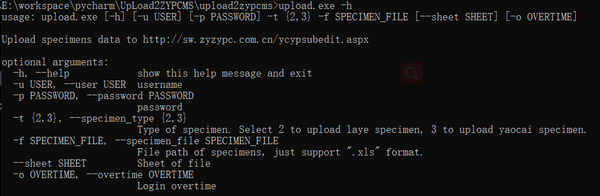

# 使用方法

1. 下载安装包，解压；
2. 在解压文件夹下打开命令行;
3. 查看使用帮助
   upload.exe -h
   显示如下则成功安装了；
   
4. 参数说明  
   -f 标本文件，必须是 xls 后缀；  
   -s 标本数据在 excel 文件的 sheet 序号；  
   -t 标本类型，2 表示腊叶标本，3 表示药材标本；  
   -o 登录超时时间； 
   -u 账号名；  
   -p 密码；  
   --sheet Excel 的 sheetname；  
   --start Excel 表格中从第几条数据开始上传；
5. 上传腊叶标本
   Excel 表格的表头必须包含（采集号，标本状态(花), 标本状态(果)， 数量，箱号）
   ```bash
   upload.exe -t 2 -f laye.xls --sheet 0 --start 0
   ```
6. 上传药材标本
   Excel 表格的表头必须包含（采集号，重量，箱号）
   ```bash
   upload.exe -t 3 -f yaocai.xls --sheet 0 --start 0
   ```
